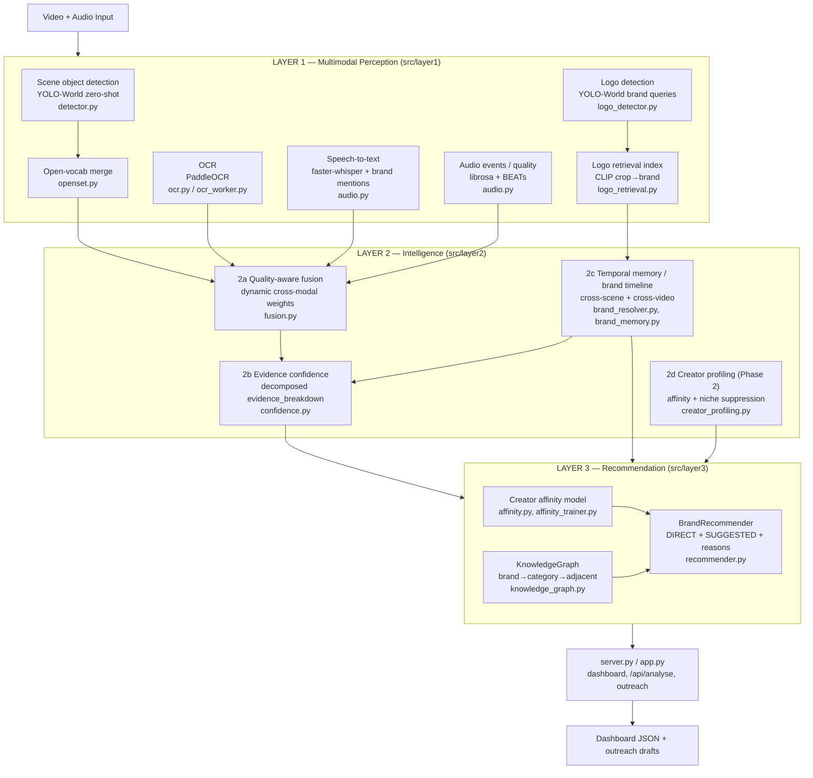

# ContextLens — Architecture Diagram

Rendered by GitHub / any Mermaid viewer.

## Full system



## Phase 1 request flow (implemented end-to-end)

```mermaid
sequenceDiagram
    participant U as User
    participant S as server.py
    participant P as Phase1Pipeline
    participant L1 as Layer 1
    participant L2 as Layer 2 a/b/c
    participant L3 as Layer 3

    U->>S: POST /api/analyse (upload)
    S->>S: queue job (background thread)
    S->>P: process_video(path, frame_rate=1.0)
    P->>L1: frames@1fps → scene det + logo det + OCR; audio → STT + events
    L1-->>P: aligned signals
    P->>P: BrandResolver: class-match → crop-OCR → CLIP retrieval → unresolved
    P->>L2: build_brand_timeline + weighted fusion
    L2-->>P: evidence_breakdown, confidence
    P->>L3: recommend(detected brands)
    L3-->>P: ranked DIRECT + SUGGESTED recs (with reasons)
    P-->>S: dashboard dict
    U->>S: GET /api/pipeline/<job>
    S-->>U: dashboard JSON
```

Source of truth for the annotated deliverable mapping: `docs/ARCHITECTURE_AND_RESEARCH.md`.
